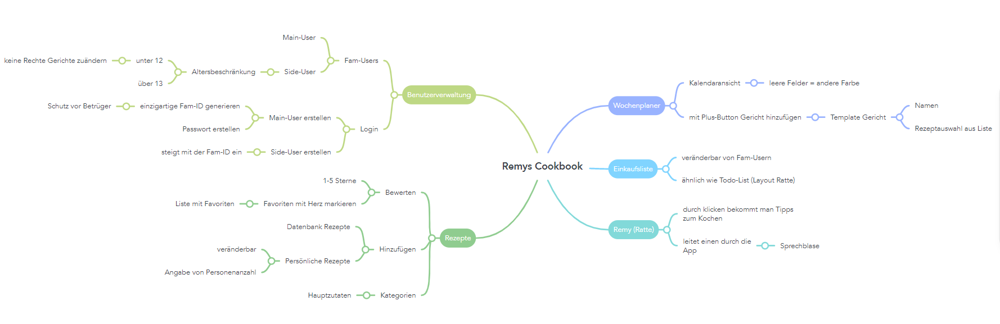
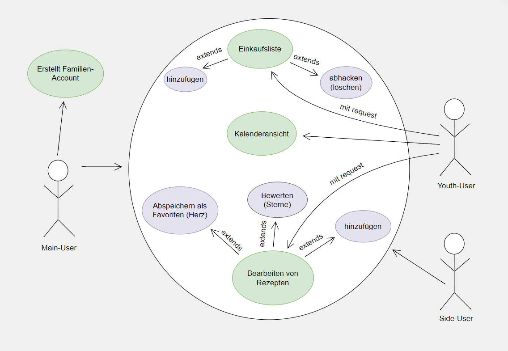
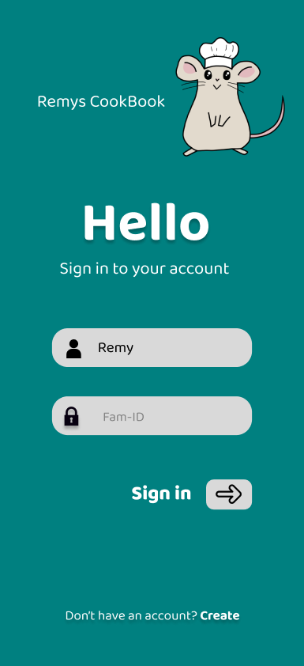
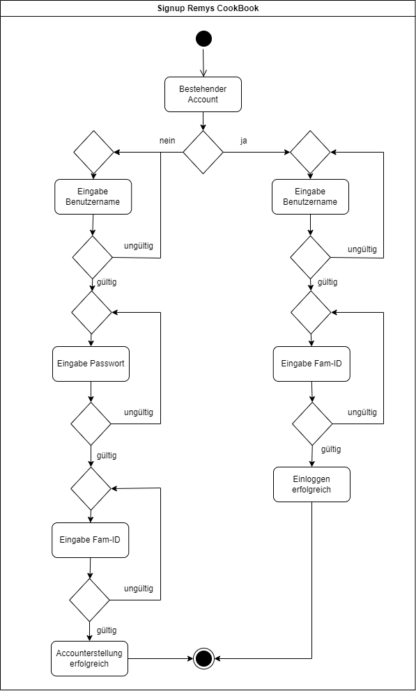
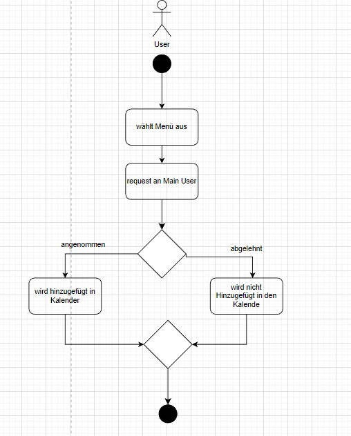
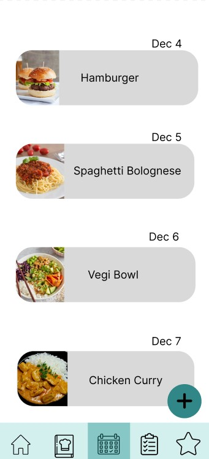
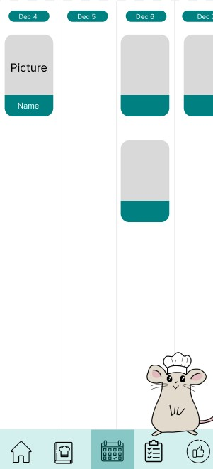
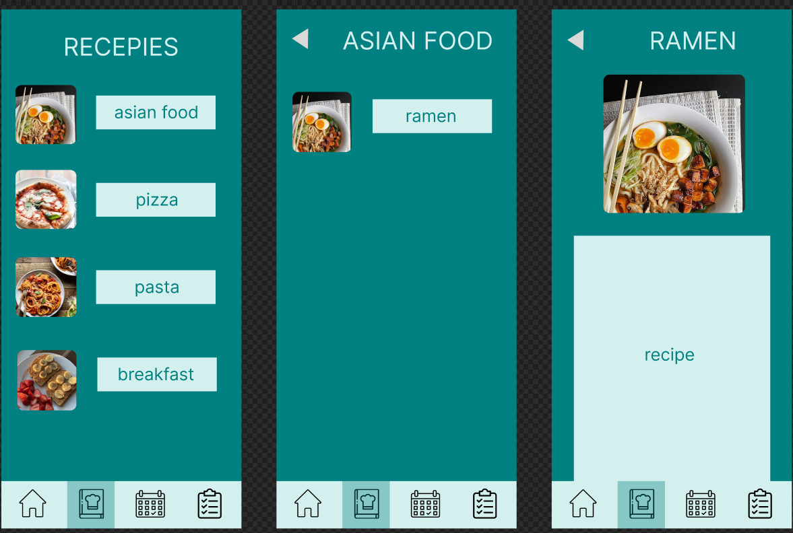
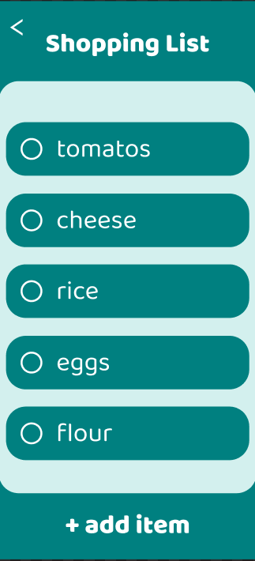

# System-Spezifikation `Remys CookBook`

## 1. Ausgangslage und Zielsetzung

### 1.1. Ist-Situation
---
Selten gelingt es Familien einen strukturierten sowie organisierten Essensplan zu erstellen. Oftmals wiederholen sich die Gerichte. Dadurch fehlt die ausgewogene und abwechslungsreiche Ernährung. 

### MyRecipe-Inspiration:
Wir möchten unser Projekt so ähnlich aufbauen wie "myRecipe". Jedoch gefallen uns einige Aspekte nicht bzw. erweitern wir noch einige Features (z.B. eine Einkaufsliste oder das Merken von Rezepten unter Favoriten). Das Design übernehmen wir nicht. Einen random Essensgenerator für Unentschlossene würden wir gerne übernehmen. 

### 1.2. Verbesserungspotenziale
---
### Probleme:
* Haushalte können sich oft nicht über ihre täglichen Mahlzeiten einigen
  * durch unterschiedliche Zeitpläne fällt das Planen der Menüs schwer
    * -> keine abwechslungsreiche und ausgewogene Ernährung
* bisher existieren noch keine Apps, die alle Features erfüllen
  * enthalten nur z.B. eine Einkaufsliste oder das Verwalten der Rezepte, eine Figur, die die Benutzer durch das Programm leitet sowie eine Bewertung mit 1-5 Sternen oder das Abspeichern von Lieblingsrezepten durch ein Herz gibt es noch nicht

### Verbesserungen:
* einfachere Kommunikation mit eines veränderbaren Wochenessensplan
  * übersichtlicher Kalender
  * abwechslungsreiche Gerichte
* Interaktion mit Familie/Mitbewohnern
  * jeder Benutzer erstellt einen Account
* Rezepte in einem Register verwalten
  * bewerte mit Sternen
  * speichern als Favorit mit Herz 
    * eigene Favoritenliste
* Einkaufsliste

### 1.3 Zielsetzung
---
Unser Ziel ist es Familien das Planen und Organisieren ihres Essensplan zu erleichtern. In unserem Anwendungsprogramm sind alle Features vereint.

Es verfügt über eine Kalenderansicht, bei der man mit Hilfe eines Buttons Gerichte für den Tag vorschlagen kann (Request), die der Main-User bestätigt oder nicht. Falls diese Speise noch nicht in der Rezeptliste vorhanden ist, kann es einfach hinzugefügt und mit Sternen von 1- 5 bewertet werden. Die Rezepte sind auch unterteilbar in Kategorien. Favoriten werden mit einem Herz markiert und sind in einer eigenen Liste wieder auffindbar.

Falls Zutaten von dem gewünschten ausgewählten Rezept in einem Haushalt fehlen, kann ganz einfach eine Einkaufsliste, ähnlich wie eine Todo-Liste, erstellt werden. 

Unsere Benutzerverwaltung unterteilt sich in zwei Bereiche. Einen Main-User, welcher den Plan erstellt und Side-Users, die mit einer Fam-ID in den Essensplan einsteigen können. Jedes Mitglied kann Gerichte vorschlagen, jedoch kann nur der Main-User den Essenswunsch schlussendlich festlegen. Er muss es sozusagen bestätigen.

Die Anwendung enthält außerdem ein Maskottchen, das die Benutzer durch die App leitet. Tipps sind durch Klicken auf die Figur erhältlich. Außerdem kann es für die Benutzer random Rezepte vorschlagen, die abgelehnt oder bestätigt werden können. Der Button sieht aus wie ein Glücksrad. 

## 2. Funktionale Anforderungen

### 2.1. Use Case Überblick

#### 2.1.1. Use Case Diagramm 

- **Main-User:** erstellt den Familien-Account und verwaltet den Kalender mit den Request. Er kann die Speisen akzeptieren und zum Essensplan hinzufügen und verteilt die Rechte an die Youth-User. Außerdem verfügt er über die generellen Rechte wie der Side-User. 
- **Side-User:** besitzt die generellen Rechte: 
  - sieht den Kalender
  - Einkaufsliste bearbeiten (Produkte hinzufügen und löschen)
  - Bearbeiten von Rezepten:
    - hinzufügen
    - bewerten (Sternen)
    - abspeichern als Favorit (Herz)
- **Youth-User:** sieht den Kalender und kann einen Request mit dem gewünschten Produkt, welches er zur Einkaufsliste hinzufügen will, an den Main-User senden. Dies gilt auch für das Hinzufügen eines Menüs zum Essensplan. Er besitzt trotzdem die Rechte um Rezepte zu bewerten und abzuspeichern als Favorit. 
### 2.2. Use Case Account-Erstellung

#### 2.2.1 GUI-Design

 

Hierbei handelt es sich um ein Login-System, wo die Fam-ID als Schlüssel zum Einsteigen in den Essensplan verwendet wird. Sollte noch kein Account bestehen, wird der Main-User aufgefordert einen Benutzernamen, Passwort sowie eine Fam-ID einzugeben. Weitere Benutzer können mit der festgelegten Fam-ID in den Essensplan einsteigen. 

#### 2.2.2 Workflow

- Bei jeder Eingabe wird das Format auf Gültigkeit und die Existenz überprüft.

- Wenn ein User ein Menü auswählen will, muss das Menü zuerst von dem Main User bestätigt werden, wenn das Menü bestätigt worden ist, sieht man es auf dem Kalender.  Ist dies nicht der Fall bleibt der Kalender leer.

### 2.3. Use Case Kalenderansicht
#### 2.3.1 GUI-Design

 

Hierbei sieht man das die jeweiligen eingetragenen Menüs für den Tag, die der Main-User bestätigt hat. Die Request werden von dem Main-User unter dem Button "manage Requests" verwaltet. Er kann diese bestätigen und somit das Gericht in den Essensplan hinzufügen oder ablehnen.

#### 2.3.2 Workflow

### 2.4. Use Case Rezeptansicht

#### 2.4.1 GUI-Design

Die Rezepte können nach bestimmten Kategorien angezeigt werden. 

#### 2.4.2 Workflow

- Es werden alle Rezepte, die in die bestimmte Kategorie hineinfallen, vom Server geladen und angezeigt.

### 2.5. Use Case Einkaufsliste

#### 2.5.1 GUI-Design

#### 2.5.2 Workflow

- Die einzelenen Zutaten können mit dem Butto hinzugefügt und mit dem Kreis wieder gelöscht werden. 

## 3. Nicht-funktionale Anforderungen

Nicht-funktionale Anforderungen beschreiben Anforderungen an das System, die nicht-fachlicher Natur sind, jedoch entscheidend zur Anwendbarkeit des Systems beitragen. Sie definieren beispielsweise Qualitätsanforderungen, Sicherheitsanforderungen oder Performanceanforderungen.

Nicht-funktionale Anforderungen definieren grundlegende Eigenschaften eines Systems, die im Architekturentwurf berücksichtigt werden müssen. Da diese Anforderungen auch die Entwicklungskosten beeinflussen (können), müssen sie messbar beschrieben werden.

- FALSCH: Das System muss schnell sein.
- RICHTIG: Daten müssen spätestens innerhalb von 500 ms zurückgegeben werden.

Zur einfachen Strukturierung der Anforderungen werden diejenigen Anforderungen, die nicht eindeutig zu den funktionalen Anforderungen gehören, den nicht-funktionalen Anforderungen zugeordnet.

Hier ein Überblick über mögliche nicht-funktionale Anforderungen:

### `Usability`: Benutzbarkeitsanforderung

- Wie muss die Software beschaffen sein, damit die Zielgruppe gerne damit arbeitet?
- Beispiel:
  - Die Software soll dem Erscheinungsbild anderer Produkte des Herstellers entsprechen.

### `Efficiency`: Effizienzanforderung

- Hier geht es sowohl um Laufzeit- als auch um Speichereffizienz. Was wird unter dem sparsamen Einsatz dieser Ressourcen verstanden?
- Beispiel:
  - Die Berechnung darf nicht länger als 0,25 Sekunden dauern.

### `Maintenance`: Wartbarkeits- und Portierbarkeitsanforderung

- Welcher Grad an Änderbarkeit wird gefordert? Hier werden, soweit wie möglich, kommende Anpassungen und Erweiterungen vorhergesehen.
- Beispiel:
  - Das Produkt soll später auch in englischer Sprache verfügbar sein.

### `Security`: Sicherheitsanforderung

- Zu den Sicherheitsanforderungen gehören die Aspekte Vertraulichkeit, Datenintegrität und Verfügbarkeit.
  - Wie sehr müssen die Daten vor dem Zugriff durch Dritte geschützt werden?
  - Ist es entscheidend, die Korrektheit der erfassten Daten und ihre Konsistenz zu gewährleisten?
  - Dürfen Systemausfälle vorkommen?
- Beispiel:
  - Das System muss gewährleisten, dass Daten nie verändert werden können.

### `Legal`: Gesetzliche Anforderung

- Welche Standards und Gesetze müssen beachtet werden?
- Beispiel:
  - Das Produkt muss die ISO 9000 Norm erfüllen.

## 4. Mengengerüst

Zur Abschätzung der aufkommenden Datenmengen und damit verbunden der notwendigen Infrastruktur, um die nötige Performance zu erzielen, ist ein Mengengerüst zu erstellen. Mögliche Fragestellungen:

- Wieviele User werden erwartet?
- Wieviele Daten pro User werden erwartet?
- Mit welcher Anfrage-Frequenz wird gerechnet?

## 5. Systemarchitektur

- Auflistung der Softwarekomponenten in einem Verteilungsdiagramm (typisch: Client - Server - Datenbank).
- Beispiel:

