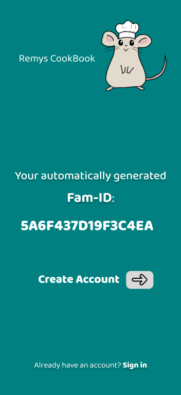
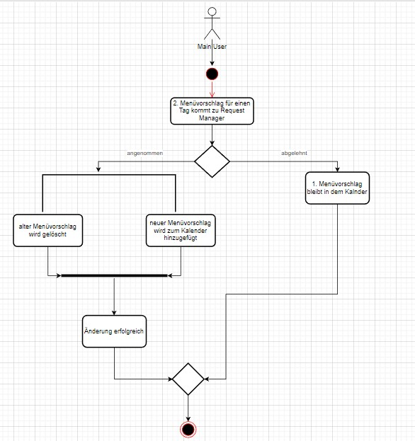

# System-Spezifikation `Remys CookBook`

## 1. Ausgangslage und Zielsetzung

### 1.1. Ist-Situation
---
Selten gelingt es Familien einen strukturierten sowie organisierten Essensplan zu erstellen. Oftmals wiederholen sich die Gerichte. Dadurch fehlt die ausgewogene und abwechslungsreiche Ernährung. 

### MyRecipe-Inspiration:
Wir möchten unser Projekt so ähnlich aufbauen wie "myRecipe". Jedoch gefallen uns einige Aspekte nicht bzw. erweitern wir noch einige Features (z.B. eine Einkaufsliste oder das Merken von Rezepten unter Favoriten). Das Design übernehmen wir nicht. Einen random Essensgenerator für Unentschlossene würden wir gerne übernehmen. 

### 1.2. Verbesserungspotenziale
---
### Probleme:
* Haushalte können sich oft nicht über ihre täglichen Mahlzeiten einigen
  * durch unterschiedliche Zeitpläne fällt das Planen der Menüs schwer
    * -> keine abwechslungsreiche und ausgewogene Ernährung
* bisher existieren noch keine Apps, die alle Features erfüllen
  * enthalten nur z.B. eine Einkaufsliste oder das Verwalten der Rezepte, eine Figur, die die Benutzer durch das Programm leitet sowie eine Bewertung mit 1-5 Sternen oder das Abspeichern von Lieblingsrezepten durch ein Herz gibt es noch nicht

### Verbesserungen:
* einfachere Kommunikation mit eines veränderbaren Wochenessensplan
  * übersichtlicher Kalender
  * abwechslungsreiche Gerichte
* Interaktion mit Familie/Mitbewohnern
  * jeder Benutzer erstellt einen Account
* Rezepte in einem Register verwalten
  * bewerte mit Sternen
  * speichern als Favorit mit Herz 
    * eigene Favoritenliste
* Einkaufsliste

### 1.3 Zielsetzung
---
Unser Ziel ist es Familien das Planen und Organisieren ihres Essensplan zu erleichtern. In unserem Anwendungsprogramm sind alle Features vereint.

Es verfügt über eine Kalenderansicht, bei der man mit Hilfe eines Buttons Gerichte für den Tag vorschlagen kann, die der Main-User bestätigt, austauscht oder ablehnt. Falls ein Speise noch nicht in der Rezeptliste vorhanden ist, kann es einfach hinzugefügt werden. Ein bereits bestehndes Rezept kann auch geändert bzw. gelöscht werden. Sobald man das Menü gekostet hat, kann man das Rezept mit Sternen (1- 5) bewerten. Die Rezepte sind auch unterteilbar in Kategorien, also filterbar. Unter Lieblingsrezepten werden alle Menüs angezeigt, die mit 5 Sternen bewerten wurden. 

Sobald ein Gericht in den Essensplan aufgenommen wird, werden seine Zutaten zur Einkaufsliste hinzugefügt. Durch abhacken werden alle benötigten Zutaten, die man bereits zu Hause hat, von der Einkaufsliste gelöscht. Produkte, die nicht in einem Rezept vorkommen, können durch einen Button hinzufüget werden.

Unsere Benutzerverwaltung unterteilt sich in zwei Bereiche. Einen Main-User, welcher den Plan erstellt und Users bzw. Youth-Users, die mit einer Fam-ID und einem Passwort in den Essensplan einsteigen können. Jedes Mitglied kann Gerichte vorschlagen, jedoch kann nur der Main-User den Essenswunsch schlussendlich festlegen. Der Main-User verteilt auch die Rechte, indem er auswählt, wer ein normaler User oder Youth-User ist. 

Die Anwendung enthält außerdem ein Maskottchen, das die Benutzer durch die App leitet und Menüvorschläge durch Klicken auf die Figur verteilt. 

## 2. Funktionale Anforderungen

### 2.1. Use Case Überblick

#### 2.1.1. Use Case Diagramm 

- **Main-User:** erstellt den Familien-Account und verwaltet den Kalender mit den Menüvorschlägen. Er kann die Speisen akzeptieren und zum Essensplan hinzufügen, ablehnen oder mit einem anderen Vorschlag austauschen. Zusätzlich wählt er unter den Mitgliedern die Youth-User aus. Außerdem verfügt er über die generellen Rechte. 
- **Side-User:** besitzt die generellen Rechte: 
  - sieht den Kalender/Rezepte
  - ein Gericht für den Plan vorschlagen
  - kann ein Produkt zur Einkaufsliste hinzufügen/löschen 
  - Bearbeiten von Rezepten:
    - hinzufügen
    - ändern
    - löschen
    - bewerten (1-5 Sterne)
  - Menüvorschlag von Remy erhalten
  - Rezepte nach einer Kategorie filtern
- **Youth-User:** 
  Er besitzt die generellen Rechte ausgenommen der Erstellung, das Ändern und Löschen eines Rezepts.
  
### 2.2. Use Case Erstellen des Accounts

#### 2.2.1 GUI-Design

 

Zuerst wird nach einem Benutzernamen sowie Passwort gefragt. Ist die Eingabe gültig, wird die Fam-ID, eine 16-stellige Hexadezimal-Nummer, vom  System erzeugt. Die Person, die den Account erstellt, wird automatisch als Main-User angesehen. Es gibt nur einen Main-User und er kann auch nicht auf ein anderes Mitglied geändert werden. Weitere Benutzer können mit der festgelegten Fam-ID in den Essensplan einsteigen (genauers dazu in dem UC Login Main-User/User). 

#### 2.2.2 Workflow

- **TODO**

### 2.3. Use Case Login Main-User/User

#### 2.3.1 GUI-Design

Hierbei handelt es sich um ein Login-System, wo die automatisch generierte Fam-ID als Schlüssel zum Einsteigen in den Essensplan verwendet wird. Sollte ein Benutzer zum ersten Mal in den Essensplan einsteigen, erkennt das System dies und erstellt einen neuen Benutzer.

#### 2.3.2 Workflow

- **TODO**

### 2.3. Use Case Kalenderansicht
#### 2.3.1 GUI-Design

Hierbei sieht man das die jeweiligen eingetragenen Menüs für den Tag, die der Main-User bestätigt hat. Die Request werden von dem Main-User unter dem Button "manage Requests" verwaltet. Er kann diese bestätigen und somit das Gericht in den Essensplan hinzufügen oder ablehnen.

#### 2.4.2 Workflow

- Wenn ein User ein Menü auswählen will, muss das Menü zuerst von dem Main User bestätigt werden. Sobald das Menü bestätigt worden ist, wird es auf dem Kalender angezeigt. Ist dies nicht der Fall bleibt der Kalender leer.

### 2.5. Use Case Menü für den Essensplan vorschlagen
#### 2.5.1 GUI-Design

Um einen Menüvorschlag zu machen muss man zuerst auf den Plus-Button in der Kalenderansicht drücken. Danach wird man zu einer neuen Seite geführt (Abbildung 2) die alle Rezepte anzeigt, die es gibt, dazu gibt es auch einen Filter für verschiedene Kategorien (Italienisch, Mexikanisch...). Durch einen Klick kommt man auf das Rezept und kann dieses hinzufügen. Hier drückt man wieder auf den Plus Button und ein Kalender wird angezeigt. In dem Kalender kann man das gewünschte Datum auswählen und mit dem Button "Ok" wird ein Request ausgeschickt. 

### 2.6. Use Case Akzeptieren/Ablehnen eines Menüvorschlags
#### 2.6.1 GUI-Design

#### 2.6.2 Workflow

### 2.7. Use Case Austauschen eines Menüvorschlags
#### 2.7.1 GUI-Design

Mit dem Switch Button kann man ein anderes vorgeschlagenes Rezept auswählen.

#### 2.3.2 Workflow

Der Main-User bekommt eine neue Menürequest für denselben Tag. Er kann ihn entweder ablehnen dann bleibt der alte Menüvorschlag im Kalender. Falls der Main-User den Menüvorschlag annimmt, wird der alte Menüvorschlag gelöscht und der neue kommt zur Kalenderansicht.

### 2.8. Use Case Ansehen von Rezepten
#### 2.8.1 GUI-Design

 TODO

### 2.9. Use Case neues Rezept erstellen
#### 2.9.1 GUI-Design

TODO

#### 2.9.2 Workflow

TODO

### 2.10. Use Case Ändern eines Rezepts

#### 2.10.1 GUI-Design

TODO

### 2.11. Use Case Löschen eines Rezepts

#### 2.11.1 GUI-Design

TODO

### 2.12. Use Case Bewerten eines Rezepts

#### 2.12.1 GUI-Design

TODO

### 2.13. Use Case Ansehen von Lieblingsrezepten (5 Sterne)

#### 2.13.1 GUI-Design

Alle Rezepte die mit 5 Sternen bewertet wurden, werden hier angezeigt. Um ein Rezept von dieser Liste zu entfernen muss die Sterne-Bewertung auch entfernt werden.  
Durch das Drücken auf ein bestimmtes Rezept erhält man eine detailiertere Ansicht der Personen, die das Rezept mit 5 Sternen bewertet haben und die Möglichkeit es zum Kalendar hinzuzufügen.

### 2.14. Use Case Filtern von Rezepten

#### 2.14.1 GUI-Design

TODO

#### 2.14.2 Workflow

TODO

### 2.15 Use Case Erhalten eines Rezeptvorschlags durch Remy

#### 2.15.1 GUI-Design

TODO

### 2.16. Use Case Produkt zur Einkaufsliste hinzufügen

#### 2.16.1 GUI-Design

TODO

#### 2.16.2 Workflow

TODO

### 2.17. Use Case Produkt von der  Einkaufsliste löschen

#### 2.17.1 GUI-Design

TODO

#### 2.17.2 Workflow

TODO

### 2.18. Use Case Auswahl der Youth-User

#### 2.18.1 GUI-Design

TODO

## 3. Nicht-funktionale Anforderungen

Nicht-funktionale Anforderungen beschreiben Anforderungen an das System, die nicht-fachlicher Natur sind, jedoch entscheidend zur Anwendbarkeit des Systems beitragen. Sie definieren beispielsweise Qualitätsanforderungen, Sicherheitsanforderungen oder Performanceanforderungen.

Nicht-funktionale Anforderungen definieren grundlegende Eigenschaften eines Systems, die im Architekturentwurf berücksichtigt werden müssen. Da diese Anforderungen auch die Entwicklungskosten beeinflussen (können), müssen sie messbar beschrieben werden.

- FALSCH: Das System muss schnell sein.
- RICHTIG: Daten müssen spätestens innerhalb von 500 ms zurückgegeben werden.

Zur einfachen Strukturierung der Anforderungen werden diejenigen Anforderungen, die nicht eindeutig zu den funktionalen Anforderungen gehören, den nicht-funktionalen Anforderungen zugeordnet.

Hier ein Überblick über mögliche nicht-funktionale Anforderungen:

### `Usability`: Benutzbarkeitsanforderung

- Wie muss die Software beschaffen sein, damit die Zielgruppe gerne damit arbeitet?
  - Die Software soll einfach bedienbar sein und für jedes Alter geeignet.
- Beispiel:
  - Die Software soll dem Erscheinungsbild anderer Produkte des Herstellers entsprechen.

### `Efficiency`: Effizienzanforderung

- Hier geht es sowohl um Laufzeit- als auch um Speichereffizienz. Was wird unter dem sparsamen Einsatz dieser Ressourcen verstanden?
- Beispiel:
  - Die Berechnung darf nicht länger als 0,25 Sekunden dauern.

### `Maintenance`: Wartbarkeits- und Portierbarkeitsanforderung

- Welcher Grad an Änderbarkeit wird gefordert? Hier werden, soweit wie möglich, kommende Anpassungen und Erweiterungen vorhergesehen.
- Beispiel:
  - Das Produkt soll später auch in englischer Sprache verfügbar sein.

### `Security`: Sicherheitsanforderung

- Zu den Sicherheitsanforderungen gehören die Aspekte Vertraulichkeit, Datenintegrität und Verfügbarkeit.
  - Wie sehr müssen die Daten vor dem Zugriff durch Dritte geschützt werden?
  - Ist es entscheidend, die Korrektheit der erfassten Daten und ihre Konsistenz zu gewährleisten?
  - Dürfen Systemausfälle vorkommen?
- Beispiel:
  - Das System muss gewährleisten, dass Daten nie verändert werden können.

### `Legal`: Gesetzliche Anforderung

- Welche Standards und Gesetze müssen beachtet werden?
- Beispiel:
  - Das Produkt muss die ISO 9000 Norm erfüllen.

## 4. Mengengerüst

Zur Abschätzung der aufkommenden Datenmengen und damit verbunden der notwendigen Infrastruktur, um die nötige Performance zu erzielen, ist ein Mengengerüst zu erstellen. Mögliche Fragestellungen:

- Wieviele User werden erwartet?
- Wieviele Daten pro User werden erwartet?
- Mit welcher Anfrage-Frequenz wird gerechnet?

## 5. Systemarchitektur

- Auflistung der Softwarekomponenten in einem Verteilungsdiagramm (typisch: Client - Server - Datenbank).
- Beispiel:

