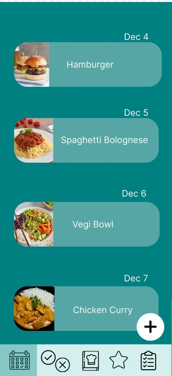
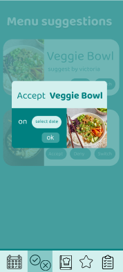
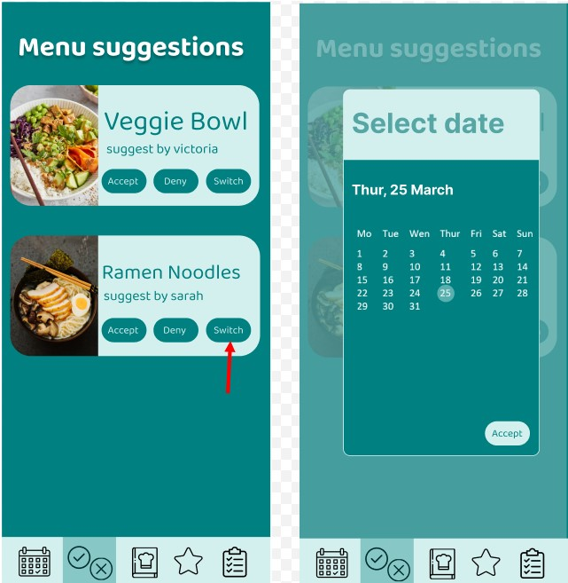
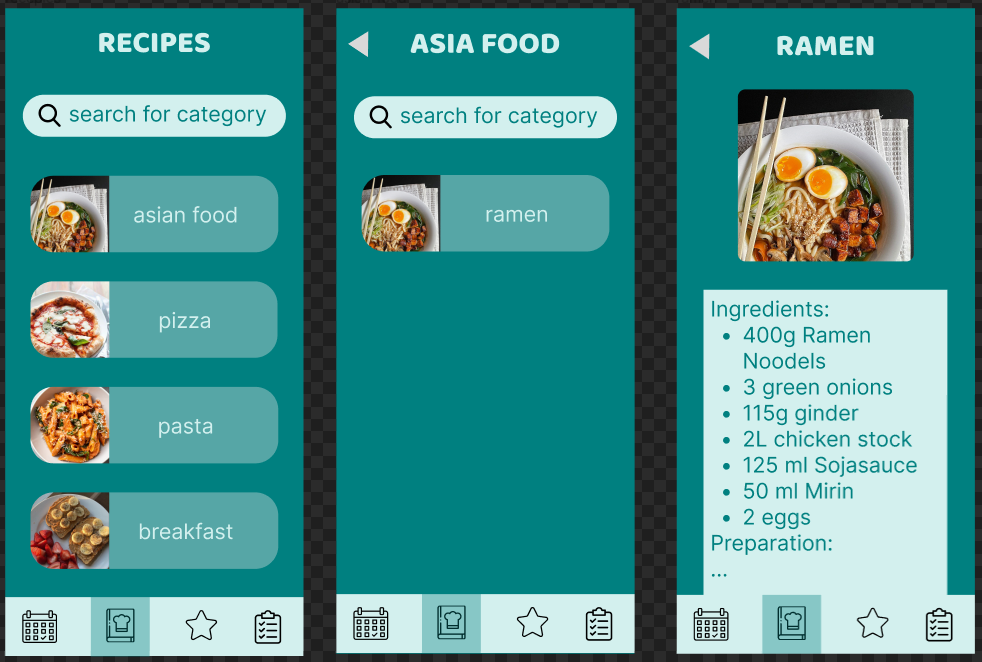
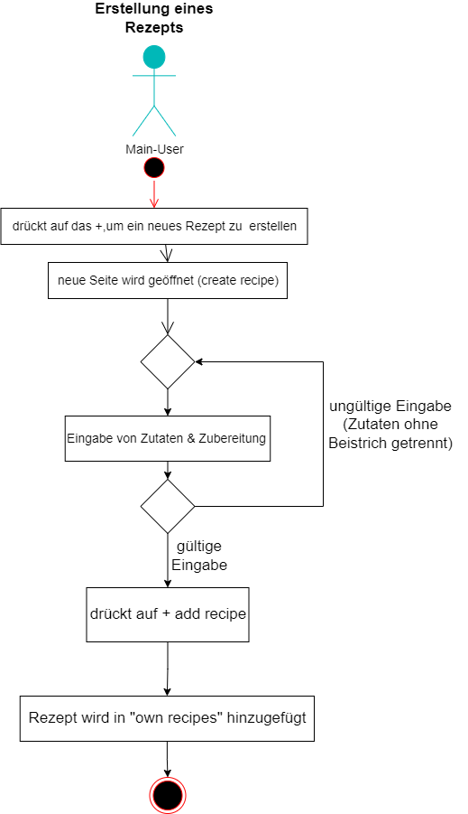

# System-Spezifikation `Remys CookBook`

# Inhaltsverzeichnis

- [1. Ausgangslage und Zielsetzung](#-1-ausgangslage-und-zielsetzung-)
  - [1.1. Ist-Situation](#-11-ist-situation-)
  - [1.2. Verbesserungspotenziale](#-12-verbesserungspotenziale-)
  - [1.3. Zielsetzung](#-13-zielsetzung-)
- [2. Funktionale Anforderungen](#-2-funktionale-anforderungen-)
  - [2.1. Use Case Überblick](#-21-use-case-überblick-)
- [3. Nicht-funktionale Anforderungen](#-3-nicht-funktionale-anforderungen-)
  - [`Usability`: Benutzbarkeitsanforderung](#-usability-benutzbarkeitsanforderung-)
  - [`Efficiency`: Effizienzanforderung](#-efficiency-effizienzanforderung-)
  - [`Maintenance`: Wartbarkeits- und Portierbarkeitsanforderung](#-maintenance-wartbarkeits--und-portierbarkeitsanforderung-)
  - [`Security`: Sicherheitsanforderung](#-security-sicherheitsanforderung-)
  - [`Legal`: Gesetzliche Anforderung](#-legal-gesetzliche-anforderung-)
- [4. Mengengerüst](#-4-mengengerüst-)
- [5. Systemarchitektur](#-5-systemarchitektur-)

## 1. Ausgangslage und Zielsetzung

### 1.1. Ist-Situation
---
Selten gelingt es Familien einen strukturierten sowie organisierten Essensplan zu erstellen. Oftmals wiederholen sich die Gerichte. Dadurch fehlt die ausgewogene und abwechslungsreiche Ernährung. 

### MyRecipe-Inspiration:
Wir möchten unser Projekt so ähnlich aufbauen wie "myRecipe". Jedoch gefallen uns einige Aspekte nicht bzw. erweitern wir noch einige Features (z.B. eine Einkaufsliste oder das Merken von Rezepten unter Favoriten). Das Design übernehmen wir nicht. Einen random Essensgenerator für Unentschlossene würden wir gerne übernehmen. 

### 1.2. Verbesserungspotenziale
---
### Probleme:
* Haushalte können sich oft nicht über ihre täglichen Mahlzeiten einigen
  * durch unterschiedliche Zeitpläne fällt das Planen der Menüs schwer
    * -> keine abwechslungsreiche und ausgewogene Ernährung
* bisher existieren noch keine Apps, die alle Features erfüllen
  * enthalten nur z.B. eine Einkaufsliste oder das Verwalten der Rezepte, eine Figur, die die Benutzer durch das Programm leitet sowie eine Bewertung mit 1-5 Sternen oder das Abspeichern von Lieblingsrezepten durch ein Herz gibt es noch nicht

### Verbesserungen:
* einfachere Kommunikation mit eines veränderbaren Wochenessensplan
  * übersichtlicher Kalender
  * abwechslungsreiche Gerichte
* Interaktion mit Familie/Mitbewohnern
  * jeder Benutzer erstellt einen Account
* Rezepte in einem Register verwalten
  * bewerte mit Sternen
  * speichern als Favorit mit Herz 
    * eigene Favoritenliste
* Einkaufsliste

### 1.3 Zielsetzung
---
Unser Ziel ist es Familien das Planen und Organisieren ihres Essensplan zu erleichtern. In unserem Anwendungsprogramm sind alle Features vereint.

Es verfügt über eine Kalenderansicht, bei der man mit Hilfe eines Buttons Gerichte für den Tag vorschlagen kann, die der Main-User bestätigt, austauscht oder ablehnt. Falls ein Speise noch nicht in der Rezeptliste vorhanden ist, kann es einfach hinzugefügt werden. Ein bereits bestehndes Rezept kann auch geändert bzw. gelöscht werden. Sobald man das Menü gekostet hat, kann man das Rezept mit Sternen (1- 5) bewerten. Die Rezepte sind auch unterteilbar in Kategorien, also filterbar. Unter Lieblingsrezepten werden alle Menüs angezeigt, die mit 5 Sternen bewerten wurden. 

Sobald ein Gericht in den Essensplan aufgenommen wird, werden seine Zutaten zur Einkaufsliste hinzugefügt. Durch abhacken werden alle benötigten Zutaten, die man bereits zu Hause hat, von der Einkaufsliste gelöscht. Produkte, die nicht in einem Rezept vorkommen, können durch einen Button hinzufüget werden.

Unsere Benutzerverwaltung unterteilt sich in zwei Bereiche. Einen Main-User, welcher den Plan erstellt und Users bzw. Youth-Users, die mit einer Fam-ID und einem Passwort in den Essensplan einsteigen können. Jedes Mitglied kann Gerichte vorschlagen, jedoch kann nur der Main-User den Essenswunsch schlussendlich festlegen. Der Main-User verteilt auch die Rechte, indem er auswählt, wer ein normaler User oder Youth-User ist. 

Die Anwendung enthält außerdem ein Maskottchen, das die Benutzer durch die App leitet und Menüvorschläge durch Klicken auf die Figur verteilt. 

## 2. Funktionale Anforderungen

### 2.1. Use Case Überblick

#### 2.1.1. Use Case Diagramm 

- **Main-User:** erstellt den Familien-Account und verwaltet den Kalender mit den Menüvorschlägen. Er kann die Speisen akzeptieren und zum Essensplan hinzufügen, ablehnen oder mit einem anderen Vorschlag austauschen. Zusätzlich wählt er unter den Mitgliedern die Youth-User aus. Außerdem verfügt er über die generellen Rechte. 
- **Side-User:** besitzt die generellen Rechte: 
  - sieht den Kalender/Rezepte
  - ein Gericht für den Plan vorschlagen
  - kann ein Produkt zur Einkaufsliste hinzufügen/löschen 
  - Bearbeiten von Rezepten:
    - hinzufügen
    - ändern
    - löschen
    - bewerten (1-5 Sterne)
  - Menüvorschlag von Remy erhalten
  - Rezepte nach einer Kategorie filtern
- **Youth-User:** 
  Er besitzt die generellen Rechte ausgenommen der Erstellung, das Ändern und Löschen eines Rezepts.
  
### 2.2. Use Case Erstellen des Accounts

#### 2.2.1 GUI-Design

 

Zuerst wird nach einem Benutzernamen sowie Passwort gefragt. Ist die Eingabe gültig, wird die Fam-ID, eine 16-stellige Hexadezimal-Nummer, vom  System erzeugt. Die Person, die den Account erstellt, wird automatisch als Main-User angesehen. Es gibt nur einen Main-User und er kann auch nicht auf ein anderes Mitglied geändert werden. Weitere Benutzer können mit der festgelegten Fam-ID in den Essensplan einsteigen (genauers dazu in dem UC Login Main-User/User). 

#### 2.2.2 Workflow

Nach der Eingabe wird das Format geprüft. Wenn dieses gültig ist, wird die Fam-ID vom System generiert und angezeigt. 

### 2.3. Use Case Login Main-User/User

#### 2.3.1 GUI-Design

Hierbei handelt es sich um ein Login-System, wo die automatisch generierte Fam-ID als Schlüssel zum Einsteigen in den Essensplan verwendet wird. Sollte ein Benutzer zum ersten Mal in den Essensplan einsteigen, erkennt das System dies und erstellt einen neuen Benutzer. Ein neuer Benutzer erhält die Rechte des Youth-Users. Diese können aber in den Einstellung geändert werden (näheres dazu in dem UC Auswahl Youth-User).

#### 2.3.2 Workflow

Bei der Eingabe wird das Format auf die Gültigkeit geprüft. Sollte diese passen, kann sich der User einloggen. Das System kontrolliert, ob dieser User bereits angelegt ist. Falls nicht, wird er vom System automatisch hinzugefügt. Danach wird der Essensplan angezeigt. 

### 2.4. Use Case Ansehen von Speisen im Kalender
#### 2.4.1 GUI-Design

Hierbei sieht man die jeweiligen eingetragenen Menüs für den Tag, die der Main-User bestätigt hat. Die Request werden von dem Main-User unter dem Button "manage suggestions" verwaltet. Er kann diese bestätigen und somit das Gericht in den Essensplan hinzufügen oder ablehnen.

#### 2.4.2 Workflow

Wenn ein Side-User oder Youth-User ein Menü auswählen will, muss er zuerst eine "menu suggestion" an den Main-User schicken. Sobald das Menü von ihm bestätigt worden ist, wird es auf dem Kalender angezeigt. Ist dies nicht der Fall, bleibt der Kalender leer.

### 2.5. Use Case Menü für den Essensplan vorschlagen
#### 2.5.1 GUI-Design

Um einen Menüvorschlag zu machen, muss man zuerst auf den Plus-Button in der Kalenderansicht drücken. Danach wird man zu der Rezeptansicht geführt (Abbildung 2), wo es auch einen Filter für die unterschiedlichen Kategorien (Italienisch, Mexikanisch, ...) gibt. Durch einen Klick kommt man auf das Rezept und kann dieses mit einem weiteren Plus-Button hinzufügen. Dann wird ein Kalender angezeigt, in dem man das gewünschte Datum auswählen kann. Mit dem OK-Button wird dann ein Request an den Main-User ausgeschickt. 

### 2.6. Use Case Akzeptieren/Ablehnen eines Menüvorschlags
#### 2.6.1 GUI-Design

   

Nur der Main-User sieht in der Navbar den Bereich für das Akzeptieren, Ablehnen oder Austauschen eines Menüvorschlags. Mit den drei Buttons kann er das Gericht hinzufügen zum Essensplan, ablehnen oder mit einem bereits eingetragenen Essen austauschen. Drückt er auf akzeptieren, wird nach dem gewünschtem Datum gefragt und danach zum Essensplan hinzugefügt.  

#### 2.6.2 Workflow

Der Main-User sieht alle vorgeschlagenen Menüs und kann mit Buttons entscheiden, ob diese abgelehnt oder bestätigt werden. Sollte er ein Gericht bestätigen, wählt er das gewünschte Datum aus und es wird zum Essensplan hinzugefügt. Danach wird der Vorschlag gelöscht. Sollte eine Speise abgelehnt werden, wird der Vorschlag sofort gelöscht. 

### 2.7. Use Case Austauschen eines Menüvorschlags
#### 2.7.1 GUI-Design

Mit dem Switch Button kann man einen Vorschlag mit einem bereits eingetragenem Gericht austauschen.

#### 2.3.2 Workflow

Der Main-User bekommt eine neue Menu-Suggestion, die er mit einem anderen Gericht austauschen möchte. Dabei wird der alte Menüvorschlag gelöscht und der Neue an dem gewünschten Tag zum Kalender hinzugefügt.

### 2.8. Use Case Ansehen von Rezepten
#### 2.8.1 GUI-Design

1. Youth-User Ansicht

2. Main-User & Side-User Ansicht (mit + zum hinzufügen von Rezept)

Die erste Abbildung ist die Sicht des Youth-Users ohne den Plus-Button. Die zweite Ansicht ist die des Main-Users & Side-Users. Diese beiden können Rezepte erstellen (siehe 2.9). 

### 2.9. Use Case neues Rezept erstellen
#### 2.9.1 GUI-Design

Nur der Main-User & Side-User können ein neues Rezept erstellen. Drückt man auf das Plus in der rechten unteren Ecke, wird man auf eine neue Seite geleitet (Create Recipe). Hier kann man die Zutaten sowie die Anleitung für die Zubereitung eingeben. Mit dem Button "add recipe" fügt man das Rezept in die Liste hinzu. Für seine eigenen Rezepte gibt es eine eigene Kategorie ("own recipes"), die am Anfang noch leer ist. Sobald das erste Rezept erstellt ist, befindet sich dieses dann in "own recipes".

#### 2.9.2 Workflow

### 2.10. Use Case Ändern eines Rezepts

#### 2.10.1 GUI-Design

Main-User & Side-User können ihre eigenen Rezepte ändern. Unter dem Button "edit" kann man zB: Zutaten hinzufügen sowie entfernen oder die Anleitung für die Zubereitung ändern. Um die Änderungen zu speichern, drückt man auf den Button "save changes".

### 2.11. Use Case Löschen eines Rezepts

#### 2.11.1 GUI-Design

Um ein eigenens Rezept zu löschen, drückt man auf den Button "delete". Es wird eine Meldung angezeigt, ob man das Rezept wirklich löschen will. Mit "yes" wird es endgültig gelöscht.

### 2.12. Use Case Bewerten eines Rezepts

#### 2.12.1 GUI-Design

Die Bewertung befindet sich bei der Ansicht eines Rezeptes unter der Zubereitung. Es wird einem zuerst die durchschnittliche Bewertung dieses Rezeptes angezeigt und darunter die Möglichkeit gegeben, eine eigene Bewertung hinzu zu fügen. 

### 2.13. Use Case Ansehen von Lieblingsrezepten (5 Sterne)

#### 2.13.1 GUI-Design

Alle Rezepte die mit 5 Sternen bewertet wurden, werden hier angezeigt. Um ein Rezept von dieser Liste zu entfernen, muss die 5 Sternen-Bewertung auch entfernt werden.  
Durch das Drücken auf ein bestimmtes Rezept erhält man eine detailiertere Ansicht, welche Personen das Rezept mit 5 Sternen bewertet haben und die Möglichkeit es zum Kalendar hinzuzufügen.

### 2.14. Use Case Filtern von Rezepten

#### 2.14.1 GUI-Design

Rezepte können nicht nur nach Kategorien, sondern auch nach bestimmten Zutaten gefiltert werde.

#### 2.14.2 Workflow

Die User werden durch Remy informiert, dass sie nicht nur nach Rezeptnamen sondern auch nach bestimmmten Zutaten suchen können.

### 2.15 Use Case Erhalten eines Rezeptvorschlags durch Remy

#### 2.15.1 GUI-Design

Sobald man auf Remy klickt bekommt man einen Tipp, wie das Zubereiten oder Kochen erleichtert werden kann.

### 2.16. Use Case Produkt zur Einkaufsliste hinzufügen

#### 2.16.1 GUI-Design

Die Zutaten werden automatisch mit dem Hinzufügen eines Rezepts in den Kalender in die Einkaufsliste eingetragen. Der User kann anschließend diese Liste überprüfen und die Zutaten, die schon vorhanden sind löschen. Eigene Zutaten können mit dem Button "add item" hinzugefügt werden.

### 2.17. Use Case Produkt von der  Einkaufsliste löschen

#### 2.17.1 GUI-Design

 

Die Produkte auf der Einkaufsliste können mithilfe eines Klicks auf den Kreis abgehakt werden. Jedoch bleiben sie in der Liste bis man auf das Minus-Zeichen drückt, um das Rezept permanent zu löschen. Um den Status von bereits abgehakte Produkte zu ändern, drückt man erneut auf den Kreis.

### 2.18. Use Case Auswahl der Youth-User

#### 2.18.1 GUI-Design

In den Einstellungen kann der Main-User festlegen, welcher User ein Youth-User ist. Unter "members" und "right" verwaltet er die Rechte der einzelenen Mitglieder.

## 3. Nicht-funktionale Anforderungen

### `Usability`: Benutzbarkeitsanforderung
- Die Software soll einfach bedienbar/strukturiert sein und für jedes Alter geeignet.
- Die App sollte einfache Anleitung für Rezepte bieten. Sie sollte auch einen übersichtlichen Essensplan beinhalten.

### `Efficiency`: Effizienzanforderung
- Das Laden der App darf nicht länger als 2 Sekunden dauern, um User nicht abzuschrecken.
- Das Hinzufügen im genrellen oder auch im Essenplan sollte nicht länger als 0,5 Sekunden dauern. 

### `Maintenance`: Wartbarkeits- und Portierbarkeitsanforderung
- Die App soll später auch in Dark-Mode verfügbar sein.
- Remys Cookbook soll in Zukunft auch als Website verfügbar sein.

### `Security`: Sicherheitsanforderung
- Durchgehende sichere Verbindung
- Family ID ist einzigartig und darf nie verändert werden
- Passwörter werden mit Hashcode geschützt

### `Legal`: Gesetzliche Anforderung
- Persönliche Daten dürfen nicht gespeichert werden

## 4. Mengengerüst

Zur Abschätzung der aufkommenden Datenmengen und damit verbunden der notwendigen Infrastruktur, um die nötige Performance zu erzielen, ist ein Mengengerüst zu erstellen. Mögliche Fragestellungen:

- Wieviele User werden erwartet?
  - Mindestens 1 User (Main User), die Anzahl der User hängt von der Größe der Familie ab.
  - In den ersten Monaten rechnen wir mit ca. 30 Familien, später erwarten wir eine Steigerung um ein Vielfaches.
- Wieviele Daten pro User werden erwartet?
  - Die Bilder werden im Cache geladen, daher wird die Datenrate pro User sich in Grenzen halten.
- Mit welcher Anfrage-Frequenz wird gerechnet?
  - ca. 50 Requests/Tag pro Familie

## 5. Systemarchitektur

### 5.1 Deployment Diagram

### 5.2 Datenmodell

